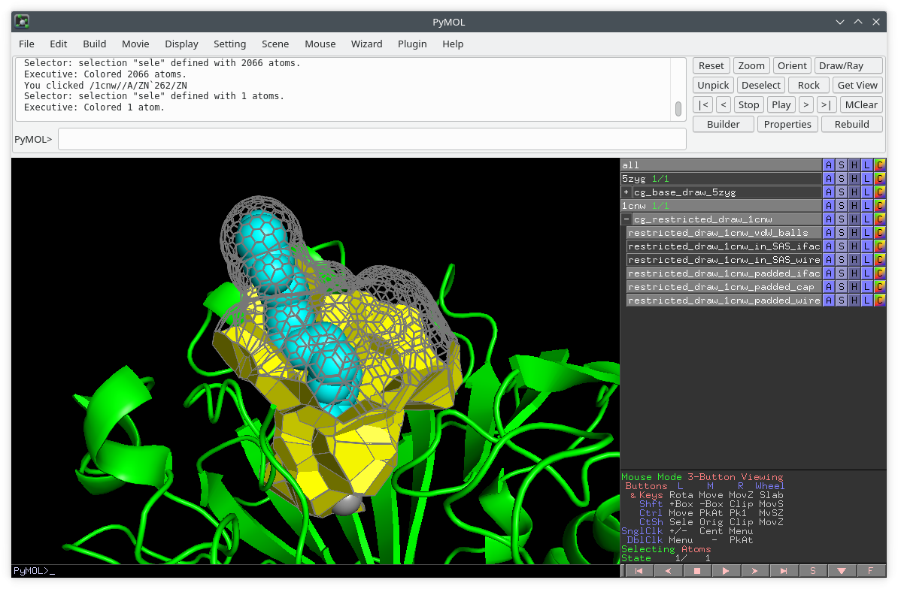

# About VoroPadding

VoroPadding is method to calculate how much space is available for atoms to occupy around a selected part of the molecular
structure (e.g. a ligand). VoroPadding pads (fills up the space around) the selected part of the input molecule (e.g. a ligand)
and then calculates the total available volume and the total interface area of the padded part.

This repository provides an alpha version of VoroPadding app.

# Obtaining and setting up VoroPadding

## Getting the latest version

The currently recommended way to obtain VoroPadding is cloning the VoroPadding git repository [https://github.com/kliment-olechnovic/voropadding-app](https://github.com/kliment-olechnovic/voropadding-app):

```bash
git clone https://github.com/kliment-olechnovic/voropadding-app.git
cd ./voropadding-app
```

## Setting up an environment for running VoroPadding

VoroPadding comes with statically built binaries for Linux in the 'tools' subdirectory.

The source code for the compilable software is included, and can be used to build all the needed executable with the following single command: 

```bash
./tools/build-all.bash
```

On Linux, VoroPadding does not require any setup apart from an optional rebuilding of the executable binaries in the 'tools' subdirectory.

Although VoroPadding was tested only on Linux, it should also work on macOS and on Windows (using the Windows Subsystem for Linux).
Before running on macOS or on Windows, please rebuild all the executables by running `./tools/build-all.bash`.


# Running the VoroPadding command-line tool

The overview of command-line options, as well as input and output, is printed when running the "voropadding" executable with "--help" or "-h" flags:

```bash
./voropadding --help

./voropadding -h
```

The following is the help message output:

```

'voropadding' script pads (fills up the space around) the selected part of the input molecule (e.g. a ligand)
and then calculates the total available volume and the total interface area of the padded part.

Options:
    --input-complex               string     input file path for a complex molecule (in PDB or mmCIF format), or '_list' to read paths from stdin
    --selection                   string     for complex input, selection of the structural part to pad and analyze, default is '(not [-protein])'
    --input-receptor              string     input file path for receptor, must be in PDB or mmCIF format
    --input-ligand                string     input file path for ligand, must be in SDF format
    --max-padding                 number     maximum number of padding layers, default is 2
    --restriction-centers         string     for complex input, selection of the atoms to be used as centers of the restriction spheres, default is ''
    --restriction-radius          number     for complex input, radius to be used for the restriction spheres (if any), default is 10.0
    --output-table-file           string     output table file path, default is '_stdout' to print to stdout
    --output-graphics-file        string     output file path for the PyMol drawing script, default is ''
    --output-padding-file         string     output file path for a table of the annotated padding points table, default is ''
    --output-padding-edges-file   string     output file path for the padding graph edges, default is ''
    --output-padding-draw-file    string     output file path for the padding drawing script for PyMol, default is ''
    --graphics-mode               string     graphics output mode, may be 'basic' or 'detailed', default is 'basic'
    --print-mode                  string     printing to stdout mode, can be 'h' or 'v', default is 'h'
    --processors                  number     maximum number of processors to run in parallel, default is 1
    --only-padding-table                     flag to only output a table of the annotated padding points (and edges file, if specified)
    --help | -h                              flag to display help message and exit

Standard output:
    space-separated table of values

Examples:

    voropadding --input-complex "./complex.pdb"

    voropadding --input-complex "./complex.pdb" --selection '[-chain B]' 

    voropadding --input-complex "./complex.pdb" --restriction-centers '[-chain A -rnum 30 -aname CB]' --restriction-radius 12.0

    voropadding --input-complex "./complex.pdb" --max-padding 3 --output-graphics-file "./padded.py"

    find ./models/ -type f -name '*.pdb' | ./voropadding --input-complex _list --processors 4 --output-table-file ./table.txt

```

# Output examples

## Basic example when input is a single complex structure

Running

```bash
./voropadding \
  --input-complex "./tests/input/complex/5zyg.pdb" \
  --output-graphics-file "./vis_5zyg.py" \
  --print-mode v
```

gives

```
input_complex        5zyg.pdb
restrictions         0
focus_atoms_count    30
max_padding          2
volume_freedom_coef  4.49694
iface_freedom_coef   2.10274
volume_padded        1695.58
iface_area_padded    1027.75
volume_unpadded      674.586
iface_area_unpadded  488.766
sasa_unpadded        41.4579
volume_vdw           377.052
```

The values are explained below:

* `input_complex` is the basename of the provided input complex file
* `restrictions` is the number of restrictions applied based on the `--restriction-centers` option 
* `focus_atoms_count` is the number of the focus atoms (usually - ligand atoms)
* `max_padding` is the maximum number of padding layers considered by the scripts
* `volume_freedom_coef` is the ratio value = `(volume_padded/volume_vdw)`
* `iface_freedom_coef`  is the ratio value = `(iface_area_padded/iface_area_unpadded)`
* `volume_padded` is the Voronoi tessellation-based volume of the ligand together with the padding
* `iface_area_padded` is the Voronoi tessellation-based total area of the interface between the receptor on one side, and the ligand and its padding on the other side
* `volume_unpadded` is the total volume of the Voronoi cells of the lingand atoms constrained inside the solvent-accessible surface
* `iface_area_unpadded` is the total area of the Voronoi faces (constrained inside the solvent-accessible surface) between the receptor and the ligand
* `volume_unpadded` is the total solvent accessible surface area of the Voronoi cells of the lingand atoms constrained inside the solvent-accessible surface
* `volume_vdw` is the volume of the union of the ligand atomic balls of van der Waals radii

The generated `vis_5zyg.py` can be opened in PyMol by its own, or together with the input structure:

```bash
pymol ./tests/input/5zyg.pdb ./vis_5zyg.py
```

which allows visualizations similar to the ones below:


## Example with additional restrictions

A user may specify a selection of an atom (or atoms) and a maximum allowed distance from the centers of the selected atoms.
This is useful for cases where there is a covalently bound ligand.
Note that if multiple atoms are selected, then multiple restrictions are combined using the `AND` logical operation, not `OR`.

Below is an example of running with additional restrictions:

```bash
./voropadding \
  --input-complex "./tests/input/complex/1cnw.pdb" \
  --selection '[-chain A -rnum 555]' \
  --restriction-centers '[-chain A -rnum 262 -aname ZN]' \
  --restriction-radius 16.0 \
  --output-graphics-file "./vis_1cnw.py" \
  --print-mode v
```

which produces the following output:

```bash
input_complex        1cnw.pdb
restrictions         1
focus_atoms_count    26
max_padding          2
volume_freedom_coef  5.67799
iface_freedom_coef   1.91799
volume_padded        1728.97
iface_area_padded    585.138
volume_unpadded      683.218
iface_area_unpadded  305.078
sasa_unpadded        233.052
volume_vdw           304.504
```

and the following visualization:




## Example processing multiple complex structures

Running

```bash
find "./tests/input/complex/" -type f -name '*.pdb' \
| ./voropadding \
  --input-complex _list \
  --max-padding 2 \
  --processors 4
```

gives

```
input_complex  restrictions  focus_atoms_count  max_padding  volume_freedom_coef  iface_freedom_coef  volume_padded  iface_area_padded  volume_unpadded  iface_area_unpadded  sasa_unpadded  volume_vdw
1cnw.pdb       0             27                 2            12.1109              2.44327             3704.75        745.389            683.218          305.078              233.052        305.902
3akm.pdb       0             31                 2            5.20473              1.88035             1963.64        999.65             625.55           531.63               37.8047        377.28
5zyg.pdb       0             30                 2            4.49694              2.10274             1695.58        1027.75            674.586          488.766              41.4579        377.052
2ifb.pdb       0             18                 2            4.07774              1.77804             1032.74        695.279            464.589          391.037              31.2068        253.263
```

## Basic example when input is a pair of a receptor and a ligand structures

Running

```bash
./voropadding \
  --input-receptor "./tests/input/receptor_ligand/5zyg_receptor.pdb" \
  --input-ligand "./tests/input/receptor_ligand/5zyg_ligand.sdf" \
  --output-graphics-file "./vis_5zyg_receptor_ligand.py" \
  --print-mode v
```

gives

```
input_receptor       5zyg_receptor.pdb
input_ligand         5zyg_ligand.sdf
focus_atoms_count    30
max_padding          2
volume_freedom_coef  4.7036
iface_freedom_coef   2.11183
volume_padded        1674.57
iface_area_padded    1029.31
volume_unpadded      658.051
iface_area_unpadded  487.403
sasa_unpadded        41.8394
volume_vdw           356.019
```

Note, that the results slightly a bit from the example with the complex `5zyg.pdb` input.
This is because in the receptor+ligand mode every ligand atom is assigned the same van der Waals radius of 1.7 angstroms,
while in the complex mode the radii are assigned in the default Voronota mode that considers different atom types.

## Example producing a detailed padding table

Running

```bash
./voropadding \
  --input-receptor "./tests/input/receptor_ligand/5zyg_receptor.pdb" \
  --input-ligand "./tests/input/receptor_ligand/5zyg_ligand.sdf" \
  --max-padding 3 \
  --print-mode v \
  --output-padding-file "./padding_5zyg.tsv"
```

will generate a tab-separated table file `./padding_5zyg.tsv`. You can look at the table [here](./tests/output/receptor_ligand_padding_table_5zyg_max_padding_3.tsv).

The generated table describes real and virtual balls with values in the following eight columns:

* `category` is the ball class, can be 'ligand' (for the real input ligand atoms) or 'padding' (for the virtual padding balls) or 'cap' (for the virtual capping balls that are not included in the volume calculation)
* `padding_layer` is the number of the padding layer
* `root_id` is the number of the topologically closest real ligand atom - the minimal number is 1
* `x`, `y`, `z`, `r` are the center coordinates and the radius of the ball
* `volume` is the volume of the Voronoi cell of the ball - such volumes are non-overlapping, and, therefore, can be summed
* `receptor_area` is the total contact area between the ball and the receptor balls
* `cap_area` is the total contact area between the ball and the capping balls

## Example producing a detailed padding table with visualizations

Running

```bash
./voropadding \
  --input-receptor "./tests/input/receptor_ligand/5zyg_receptor.pdb" \
  --input-ligand "./tests/input/receptor_ligand/5zyg_ligand.sdf" \
  --max-padding 3 \
  --print-mode v \
  --output-padding-file "./padding_5zyg.tsv" \
  --output-padding-draw-file "./draw_padding_5zyg.py" \
  --output-graphics-file "./vis_5zyg.py"
```

will generate both a padding details table `padding_5zyg.tsv`,
a PyMol script `draw_padding_5zyg.py` to visualize the padding table,
and a PyMol script `vis_5zyg.py` to visualize the padding volume and interfaces.

The generated visualization scripts can be used as follows:

```bash
pymol "./tests/input/receptor_ligand/5zyg_receptor.pdb" "./vis_5zyg.py" "./draw_padding_5zyg.py"
```
## Example producing a detailed padding table with with the padding graph edges

Running

```bash
./voropadding \
  --input-receptor "./tests/input/receptor_ligand/5zyg_receptor.pdb" \
  --input-ligand "./tests/input/receptor_ligand/5zyg_ligand.sdf" \
  --max-padding 3 \
  --print-mode v \
  --output-padding-file "./padding_5zyg.tsv" \
  --output-padding-edges-file "./padding_5zyg_edges.tsv"
```

will generate both a padding details table `padding_5zyg.tsv`,
and an adjacency table file `padding_5zyg_edges.tsv`.

The generated adjacency table has the following three columns:

* `id_a` is the first ball index, equals the position of the ball row in the main padding table
* `id_b` is the second ball index, equals the position of the ball row in the main padding table
* `area` is the the area of the Voronoi face between the balls

Important notes:

* the indices are not 0-based - the minimal ball index value is 1
* the edges do not repeat in the table


## Performance-focused example for producing a detailed padding table without any other output

Running

```bash
./voropadding \
  --input-receptor "./tests/input/receptor_ligand/5zyg_receptor.pdb" \
  --input-ligand "./tests/input/receptor_ligand/5zyg_ligand.sdf" \
  --max-padding 3 \
  --output-padding-file "./padding_5zyg.tsv" \
  --only-padding-table
```

will only generate a padding details table `padding_5zyg.tsv`.

The usage of the `--only-padding-table` flag can significantly decrease the overall execution time.

If the `--output-padding-edges-file` option is used, the padding graph edges file will also be generated.

### More performance tips

If you care about performance a lot, consider rebuilding the binary executables to enable you CPU architecture-specific optimizations by running the following commands:

```bash
./tools/build-sihsolvexpand.bash ofast
./tools/build-voronota-lt.bash ofast
```
